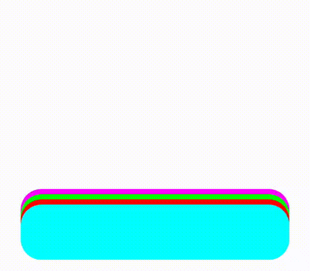
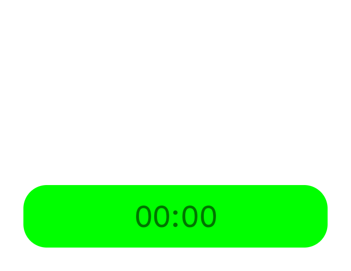
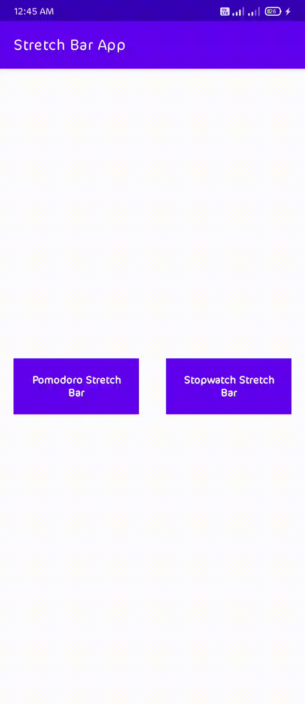
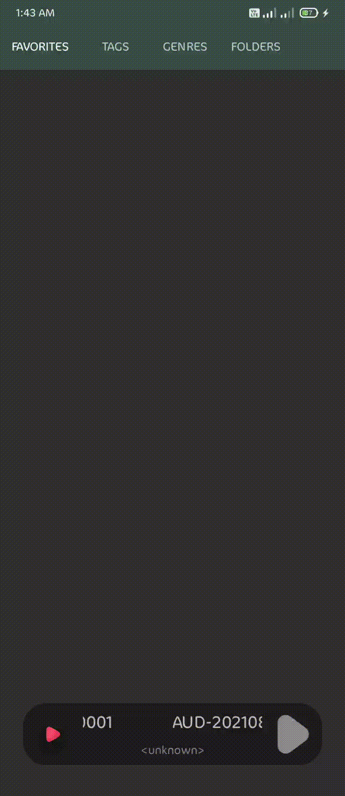

## Stretch Bar

A modern, gesture-driven bottom stretchable bar system for Android, inspired by One UI 7 behavior.
Designed for smooth animations, stacked cards, and swipe-based interactions.

✨ Features

Bottom bars with collapsed & expanded states

Stacked StretchBars with overlap effect

Gesture support:

Swipe up / down

Swipe left / right

Single tap

Smooth ConstraintLayout + Transition animations

Hardware-accelerated & RecyclerView-safe

Fully customizable behavior per bar

Clean Kotlin-first API

<p align="center">
  
</p>

## ⚙ Setup

### 1️⃣Add it in your root settings.gradle at the end of repositories (If it hasn't been added yet)

````kotlin
dependencyResolutionManagement {
    repositoriesMode.set(RepositoriesMode.FAIL_ON_PROJECT_REPOS)
    repositories {
        mavenCentral()
        maven { url 'https://jitpack.io' }
    }
}
````

### 2️⃣ implementation

````kotlin
implementation 'com.github.aboshekh:stretch-bar:Tag'
````

## 🧱 Core Components

### StretchBarContainer

````kotlin
val container = findViewById<StretchBarContainer>(R.id.stretchBarContainer)
container.addUnderBar(myStretchBar, isAnimated = true)
````

A custom ConstraintLayout that manages stacked StretchBar views.

Responsibilities:

Stack management

Swipe handling

Expansion & collapse

Focus switching

Animations & vibration feedback

### StretchBar

Abstract base class representing a single expandable bar.

You must provide:

expandedConstraintSet

collapsedConstraintSet

````kotlin
// This will be illustrated in the example below.
class MyStretchBar(context: Context) : StretchBar(context) {

    override val expandedConstraintSet = ConstraintSet().apply {
        // expanded constraints
    }

    override val collapsedConstraintSet = ConstraintSet().apply {
        // collapsed constraints
    }

}
````

### 🖐 Gestures

Gesture Default Behavior
Swipe Up Expand
Swipe Down Collapse
Swipe Left Callback
Swipe Right Callback
Single Tap Expand

Override any behavior:

````kotlin
class MyStretchBar(context: Context) : StretchBar(context) {

    override fun onCollapsedStart() {
        super.onCollapsedStart()
    }

    override fun onExpandedStart() {
        super.onExpandedStart()
    }

    override fun onCollapsedEnd() {
        super.onCollapsedEnd()
    }

    override fun onExpandedEnd() {
        super.onExpandedEnd()
    }

    override fun onSwipeLeft() {
        super.onSwipeLeft()
    }

    override fun onSwipeRight() {
        super.onSwipeRight()
    }

    /**
     * Called on upward swipe gesture.
     * Default behavior expands the StretchBar if it is collapsed.
     */
    override fun onSwipeUp() {
        super.onSwipeUp()
    }

    /**
     * Called on downward swipe gesture.
     * Default behavior collapses the StretchBar if it is expanded.
     */
    override fun onSwipeDown() {
        super.onSwipeDown()
    }

    /**
     * Called when the user taps on the root view of this StretchBar.
     * Default behavior expands the StretchBar if it is collapsed.
     */
    override fun onRootSingleTap() {
        super.onRootSingleTap()
    }

}
````

### ⚙️ Customization

````kotlin
container.maxVisibleCards = 5
container.overlapMargin = context.pxFromDp(6f)
container.isVibrate = true
````
## Example

### Stopwatch Stretch Bar
````kotlin
class StopwatchStretchBar(context: Context) : StretchBar(context) {

    /* -------------------- UI -------------------- */

    private val timerText = TextView(context).apply {
        id = generateViewId()
        gravity = TEXT_ALIGNMENT_CENTER
        text = "00:00"
        textSize = context.pxFromSp(18f).toFloat()
        textAlignment = TEXT_ALIGNMENT_CENTER
    }

    private val playButton = Button(context).apply {
        id = generateViewId()
        text = "Start"
        setOnClickListener { toggle() }
    }

    private val resetButton = Button(context).apply {
        id = generateViewId()
        text = "Reset"
        setOnClickListener { reset() }
    }

    /* -------------------- Stopwatch Logic -------------------- */

    private val handler = Handler(Looper.getMainLooper())

    private var isRunning = false
    private var startTime = 0L
    private var elapsedTime = 0L

    private val ticker = object : Runnable {
        override fun run() {
            elapsedTime = System.currentTimeMillis() - startTime
            timerText.text = elapsedTime.formatToTime()
            handler.postDelayed(this, 1000)
        }
    }

    private fun start() {
        startTime = System.currentTimeMillis() - elapsedTime
        handler.post(ticker)
        playButton.text = "Stop"
        isRunning = true
    }

    private fun stop() {
        handler.removeCallbacks(ticker)
        playButton.text = "Start"
        isRunning = false
    }

    private fun reset() {
        stop()
        elapsedTime = 0L
        timerText.text = "00:00"
    }

    private fun toggle() {
        if (isRunning) stop() else start()
    }

    /* -------------------- StretchBar -------------------- */

    override val collapsedConstraintSet: ConstraintSet
    override val expandedConstraintSet: ConstraintSet

    init {
        addView(timerText)
        addView(playButton)
        addView(resetButton)

        playButton.layoutParams = LayoutParams(0, LayoutParams.WRAP_CONTENT).apply {
            topToBottom = timerText.id
            startToStart = LayoutParams.PARENT_ID
            endToStart = resetButton.id
            setMargins(
                context.pxFromDp(16f),
                context.pxFromDp(32f),
                context.pxFromDp(8f),
                0
            )
        }

        resetButton.layoutParams = LayoutParams(0, LayoutParams.WRAP_CONTENT).apply {
            topToBottom = timerText.id
            startToEnd = playButton.id
            endToEnd = LayoutParams.PARENT_ID
            setMargins(
                context.pxFromDp(8f),
                context.pxFromDp(32f),
                context.pxFromDp(16f),
                0
            )
        }

        collapsedConstraintSet = ConstraintSet().apply {
            clone(this@StopwatchStretchBar)
            connect(
                timerText.id,
                LayoutParams.TOP,
                LayoutParams.PARENT_ID,
                LayoutParams.TOP,
                context.pxFromDp(16f)
            )
            connect(
                timerText.id,
                LayoutParams.START,
                LayoutParams.PARENT_ID,
                LayoutParams.START,
                context.pxFromDp(24f)
            )
            connect(
                timerText.id,
                LayoutParams.END,
                LayoutParams.PARENT_ID,
                LayoutParams.END,
                context.pxFromDp(24f)
            )
            connect(
                timerText.id,
                LayoutParams.BOTTOM,
                LayoutParams.PARENT_ID,
                LayoutParams.BOTTOM,
                context.pxFromDp(16f)
            )
        }

        expandedConstraintSet = ConstraintSet().apply {
            clone(this@StopwatchStretchBar)
            clear(timerText.id, LayoutParams.BOTTOM)
            connect(
                timerText.id,
                LayoutParams.TOP,
                LayoutParams.PARENT_ID,
                LayoutParams.TOP,
                context.pxFromDp(120f)
            )
            connect(
                timerText.id,
                LayoutParams.START,
                LayoutParams.PARENT_ID,
                LayoutParams.START,
                context.pxFromDp(24f)
            )
            connect(
                timerText.id,
                LayoutParams.END,
                LayoutParams.PARENT_ID,
                LayoutParams.END,
                context.pxFromDp(24f)
            )
        }
    }

    override fun onDetachedFromWindow() {
        super.onDetachedFromWindow()
        handler.removeCallbacks(ticker)
    }

    override fun onCollapsedStart() {
        playButton.visibility = INVISIBLE
        resetButton.visibility = INVISIBLE
    }

    override fun onExpandedEnd() {
        playButton.visibility = VISIBLE
        resetButton.visibility = VISIBLE
    }

}
````

add to container

````kotlin
val timerStretchBar = StopwatchStretchBar(this)
timerStretchBar.setBackgroundColor(Color.GREEN)

binding.stack.addBar(timerStretchBar, false)
````
<p align="center">
  
</p>

### Other Apps

#### Multi
<p align="center">
  
</p>

Open source application code: https://github.com/aboshekh/stretch-bar-app.git

#### Audio player
<p align="center">
  
</p>

## 📂 Package Structure

````text
com.aboshekh.stretchbar
│
├── StretchBar.kt
└── StretchBarContainer.kt
````

## 📄 License

Copyright (c) 2026 Hassan Abdelaal

Permission is hereby granted, free of charge, to any person obtaining a copy
of this software and associated documentation files (the "Software"), to deal
in the Software without restriction, including without limitation the rights
to use, copy, modify, merge, publish, distribute, sublicense, and/or sell
copies of the Software, and to permit persons to whom the Software is
furnished to do so, subject to the following conditions:

The above copyright notice and this permission notice shall be included in all
copies or substantial portions of the Software.

THE SOFTWARE IS PROVIDED "AS IS", WITHOUT WARRANTY OF ANY KIND, EXPRESS OR
IMPLIED, INCLUDING BUT NOT LIMITED TO THE WARRANTIES OF MERCHANTABILITY,
FITNESS FOR A PARTICULAR PURPOSE AND NONINFRINGEMENT. IN NO EVENT SHALL THE
AUTHORS OR COPYRIGHT HOLDERS BE LIABLE FOR ANY CLAIM, DAMAGES OR OTHER
LIABILITY, WHETHER IN AN ACTION OF CONTRACT, TORT OR OTHERWISE, ARISING FROM,
OUT OF OR IN CONNECTION WITH THE SOFTWARE OR THE USE OR OTHER DEALINGS IN THE
SOFTWARE.

## 💬 Contact

For questions, suggestions, or collaboration:

📧 **Email:** h.abdelaal.dev@gmail.com